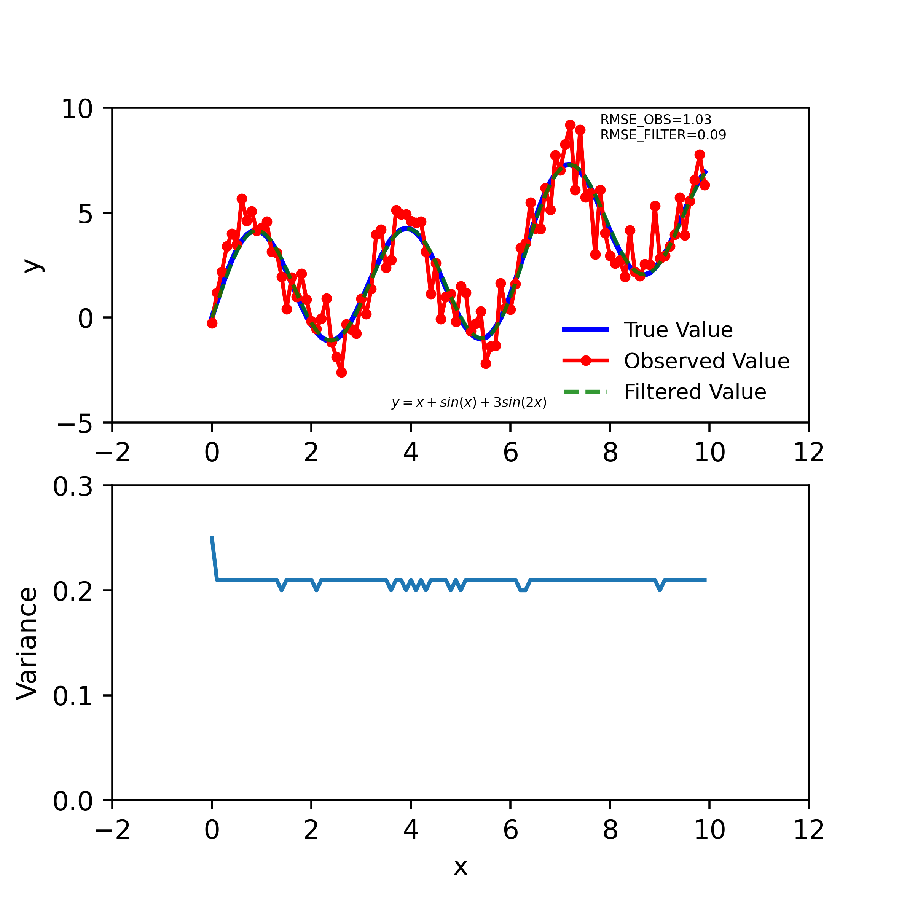
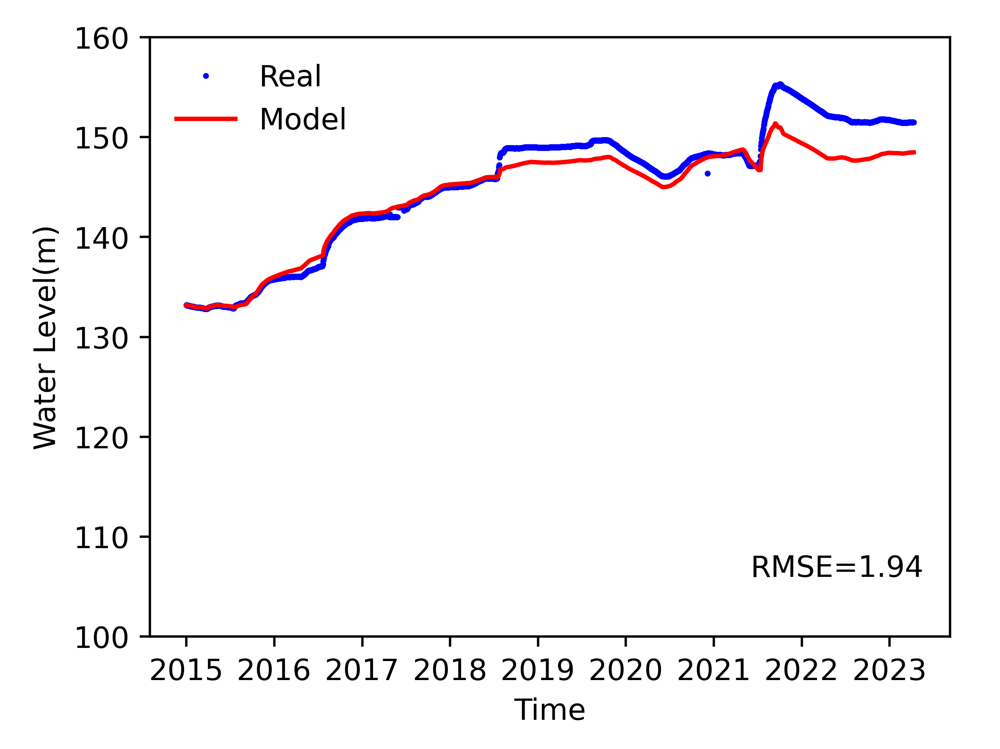

# filter
一维水动力模型，数据同化校正水位，氨化系统参数、硝化系统参数、反硝化系统参数
## 系统要求
编写环境Centos Stream9，系统需要安装git, cmake, make, gcc, gcc-g++, python3及第三方包:matplotlib, pandas.

### 源码下载命令
```bash
git clone --recursive https://gitee.com/xfwahss/Filter.git
```
### 代码编译(Windows)
```bash
cd Filter/build
cmake -G "MinGW Makefiles"  -DCMAKE_C_COMPILER=gcc -DCMAKE_CXX_COMPILER=g++ -DCMAKE_MAKE_PROGRAM=make .. # windows
cmake .. #linux
make
```

## 集合卡尔曼滤波测试
*测试文件编译及运行*
```bash
cd ./test/scripts
python3 test_ensemble_with_sin.py
```
采用随机数模拟对于系统状态的观测值，假设仪器的精度为1，那么随机观测方差可以建模为$\varepsilon \sim N(0, 1)$.真实的系统$y=0.5x+sin(x)+3sin(2x)$,观测的值为$z=y+\varepsilon$.时间步较小时，可以假设$y_{k+1}=y_{k} + \varepsilon_2, \varepsilon_2 \sim N(0, \sigma^2)$(一阶滤波器),这里取$\sigma^2=1$.利用集合卡尔曼滤波同化后，对于系统的观测值的RMSE由1.03下降至0.09.

## 数据同化前水位模拟
